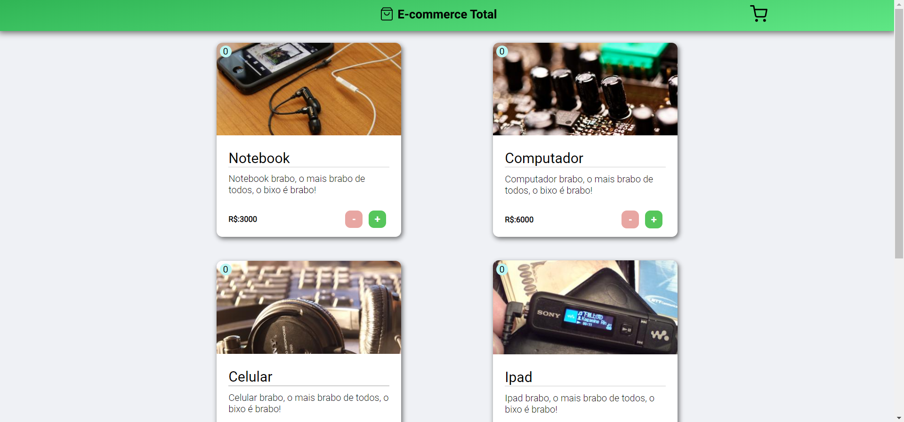
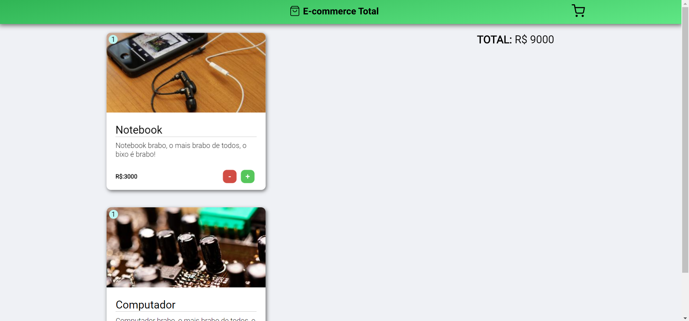

# <div align='center'> 🔥 E-commerce Total</div>

> ##### Projeto desenvolvido usando React (create-react-app).

## Instalação:

```JavaScript
  $ git clone https://github.com/Matheus0liveira/E-commerce-Total.git

  $ yarn
  //ou
  $ npm install

```

> Única dependência que esse projeto utiliza é a react-icons.

## Prints:

##### Imagens estáticas (http://lorempixel.com/), sem relação alguma com os produtos.

<div  align='center'>



  
</div>
